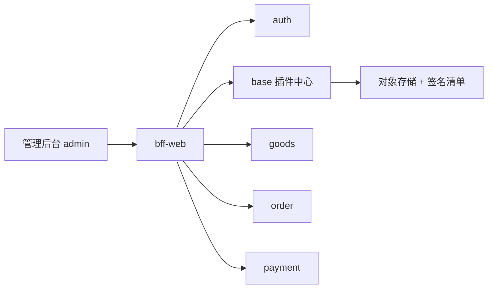

# UniMall · 开源多商户电商中台

[English](README.en.md) · [Roadmap](ROADMAP.md) · [开源推广路径](public/docs/开源推广路径.md) · [SECURITY](SECURITY.md)

> 品牌与商标：本项目名称为 **UniMall**（对外与仓库内部统一使用；`HouCloud` / `HouMEOC` 仅为历史代号，不再作为内部项目名）。
> 使用名称与 Logo 的边界见 [TRADEMARK.md](TRADEMARK.md)，二次分发、免责与责任上限见 [USAGE-AGREEMENT.md](USAGE-AGREEMENT.md)，安全责任边界见 [SECURITY.md](SECURITY.md)。

微服务架构 + 插件化扩展的**多商户电商中台**：一套后端同时支撑 PC 商城、管理后台、商户端、骑手端、门店 POS 等多端业务，插件按需装载（ERP / CRM / CMS / OA / 项目管理 / 客服 IM / 餐饮 / 收银）。

**开源漏斗**：星标 → 试用自托管 →（云端交付就绪后）付费插件 / 维护续费。开源本身不直接赚钱。  
**未就绪前不要大规模推「可购买插件」**——见 [开源推广路径 §4](public/docs/开源推广路径.md#4-可购买插件对外话术开关)。

## 推给谁 / 不推给谁

| 优先 | 受众 | 说明 |
|---|---|---|
| P0 | 中小电商 / 新零售**技术负责人**、独立站**外包团队** | 要可二开的商城中台 |
| P0 | 会 Docker/K8s 的**全栈 / Java** | **能自托管才是真实用户** |
| P1 | SaaS 创业团队 | 用 Core 搭行业方案，再买 ERP/OA/CRM |
| 少碰 | 「纯小白建站」 | 服务多，客服成本会吃掉开源红利 → 请走[代建](#不会搭可以买搭建服务)或看演示站 |

## 为什么不是又一个单体商城

| | 传统商城单体 | **UniMall** |
|---|---|---|
| 进程边界 | 一个大包部署 | **业务服务独立运行**（goods / order / payment …） |
| 扩展方式 | Fork 核心或脆弱钩子 | **插件中心** + `custom-<service>` 源码二开 |
| 行业件（ERP/OA…） | 常锁死在同一 WAR | **独立微服务制品** + 签名交付 |
| 许可证 | 常不清晰 | Core **Apache-2.0**；已购源码权利不收回 |
| 运维预期 | 「装上就算」 | [官方支持矩阵](public/docs/官方支持矩阵.md)：矩阵外 = 社区自助 |

架构基线：[系统架构.md](系统架构.md)。



- 后端：Spring Boot 3 / Spring Cloud Alibaba、**JDK 21**、Maven 多模块，Nacos 注册与配置中心，MySQL 8 + MyBatis-Plus、Redis、RocketMQ、Seata、Elasticsearch
- 前端：Vue 3 + Vite 多端应用（管理后台 `frontend/admin`、PC 商城 `frontend/pc`、会员中心 `frontend/ucenter`、商户端 `frontend/sellerapp`、供应商端 `frontend/supplier` 等）
- 扩展：`plugins/` 下每个插件自带 `plugin.yaml` 清单与数据库迁移，内嵌扩展只进入所属服务；OA / ERP / MES 等产品的主体业务为独立服务

> 后端架构以 [系统架构.md](系统架构.md) 为唯一基线：24 个业务服务独立运行，commons 为公共库。目录迁移与运行切换的状态见 [目录迁移记录](docs/architecture/directory-migration.md)。

## 目录结构

```
backend/               后端源码
  bff/                 聚合网关（bff-web，对外唯一入口 8391）
  paas/<service>/      24 个独立业务服务；mall 为待完成接管的过渡工程
  paas/base/modules/   插件管理控制面库（目录、授权、市场、制品、升级）
  contracts/<service>-api/  公开契约
  extensions/custom-<service>/  服务专属二开（官方源码不直接改）
frontend/              前端多端应用（Vite）
plugins/<service>/<code>/ 插件源码与产品元数据（开源发布快照只放行 `license: FREE`；收费服务源码按产品授权交付）
plugin-platform/       插件机制层：installer / registry / release / runtime / sdk
scripts/sql/           数据库统一初始化包（建库 + 全量表结构 + 增量迁移 + 初始数据）
scripts/nacos-templates/  Nacos 配置模板 + 变量表 + 渲染/导入脚本
docker/                Docker 构建资产（builder / 服务镜像 / 前端镜像 / Nacos 初始化）
docker-compose.yml         全栈编排（轨 B：中间件 + 14 个服务 + 管理后台）
docker-compose.middleware.yml  仅中间件（轨 A 的加速器）
.env.docker.example         Docker 环境变量样例（复制为 .env）
public/docs/           安装手册、开发手册、操作手册等文档
legacy/                历史迁移源码（不参与构建）
```

## 插件：哪些开源，哪些要买

Core（微服务中台 + 插件机制）以 **Apache-2.0** 开源。收费服务通过插件中心按产品授权交付：

- 内部只维护一个源码仓库；开源发布使用过滤后的快照，`PAID` / `TRIAL` 产品的源码和运行制品不会进入该快照。
- 用户在插件中心购买某个产品后，才能下载该 `pluginCode` 对应的源码包，并获得对应的运行制品。购买 ERP 不会开放 OA 或 CRM 的源码。
- 源码包按 Apache-2.0 提供二次开发；运行制品以 `unimall-<service>` 独立微服务运行，源码不作为运行时插件加载。
- 官方升级、补丁、迁移脚本和技术支持按对应产品的维护权益提供；维护期到期后，已安装版本继续运行，续费后恢复官方升级与支持。
- 本仓库提供的是 `plugin-platform/`（安装 / 注册 / 发布 / 运行时 / SDK）这一整套机制：装好 Core 后，从插件中心购买、授权、下载源码并安装独立微服务。
- 二开代码固定放在 `backend/extensions/custom-<service>/`；前端二开放在 `frontend/<terminal>/src/extensions/<service>/`，运行期插件放在 `plugins/<service>/<code>/`。官方服务源码保持可升级，避免直接改动导致升级覆盖或代码丢失。
- 随仓开源的免费插件：`demo-coupon`（扩展示例）、`unilogin`。

> **对外投放注意**：对象存储预签名、强制签名、购买一页安装未在生产验收前，官网/社区**不要**主推「一键购买插件」CTA，改为演示站 + 商务咨询。

## 不会搭？可以买搭建服务

源码免费，搭建收费。Core 是 14 个微服务 + 19 个容器 + 39 个 Nacos 配置构成的一套系统，
第一次从零搭到能下单，通常要 2–3 人天。如果你要的是「能跑的系统」而不是「搭建经验」：

| 档位 | 价格（一次性） | 交付周期 | 包含 |
|---|---|---|---|
| 标准部署 | ¥2,980 | 1 个工作日 | 全套环境 + 域名 HTTPS + 18 项验收清单 + 部署文档 |
| 交钥匙 | ¥3,980 | 2 个工作日 | 上述 + 业务数据初始化 + 培训录屏 + 备份脚本 + 30 天答疑 |
| 生产就绪 | ¥4,980 | 3 个工作日 | 上述 + 参数调优 + 监控告警 + 安全基线 + 90 天运维 |

不含服务器、域名与商业插件授权费；验收清单未通过全额退款。
详情与下单：<https://mall.houjit.com/deploy-service.html> · business@houjit.com

> 如果你或团队里有 Java 后端、并打算长期二开这套系统，建议自己搭一遍 ——
> 搭建过程本身就是读懂它最快的方式，下面的文档是完整的。

## 快速开始：先跑通 Demo，再选部署轨

### 开源 Demo（推荐对外展示）

最小集：**auth / permission / base / goods / order / payment / bff + admin**（内存建议 ≥8GB）。

```bash
cp .env.docker.example .env
bash scripts/docker.sh demo
# http://localhost:8080  ·  admin / Admin@123456（登录后立刻改密）
```

完整 14 服务（≥16GB）：`bash scripts/docker.sh up`。说明见 [docker/README.md](docker/README.md)。

### 两条部署轨，选一条

| 轨 | 中间件 | 后端 | 适合 |
|---|---|---|---|
| **A · 传统 jar 部署** | 自己装（或 `bash scripts/docker.sh mw` 只起中间件） | 宿主机 `mvn` + `java -jar` | 生产环境、改代码调试、Windows 服务器 |
| **B · Docker 一键编排** | 全部容器化 | 容器内编译；`demo` 最小集或 `up` 全量 | 演示、试用、CI |

### 轨 B：全量一条命令（Docker 24+ / Compose v2，内存 ≥16GB）

```bash
cp .env.docker.example .env
bash scripts/docker.sh up      # 编译后端 -> 构建镜像 -> 起 MySQL/Redis/Nacos/RocketMQ + 14 个服务 + 管理后台
```

数据库初始化（约 680 张 Core 表 + 菜单/角色/管理员）与 Nacos 配置导入都是自动的。
2026-09-19 在影子环境实测：中间件 6 个容器全部 healthy，Nacos 配置导入 **成功 39 / 失败 0**，
建库 680 张表、1346 条菜单、4 个角色、管理员 `admin` 已落库。
完成后浏览器打开 <http://localhost:8080>，账号 `admin` / `Admin@123456`。
详见 [docker/README.md](docker/README.md)。

### 轨 A：传统部署（完整步骤见 [安装手册](public/docs/安装手册.md)）

前置：**JDK 21**、Maven 3.8+、MySQL 8.0+、Redis 6+、RocketMQ 4.9+、Nacos 2.x、Node 20+（前端）。
懒得装中间件就先跑 `bash scripts/docker.sh mw`，它会连建库和 Nacos 配置一起做完。

```bash
# ① 初始化数据库（只装商城核心：建库 + 约 670 张 Core 表 + 菜单/角色/管理员）
export MYSQL_HOST=127.0.0.1 MYSQL_USER=root MYSQL_PASSWORD=你的密码
bash scripts/sql/init_all.sh

# ② 生成并导入 Nacos 配置（39 个 dataId，模板 + 变量表，无需手工改 39 个文件）
cd scripts/nacos-templates
cp variables.example variables.env   # 填入你的 MySQL/Redis/RocketMQ/Nacos 地址与口令
python3 apply_templates.py
NACOS_ADDR=127.0.0.1:8848 bash import_to_nacos.sh
cd ../..

# ③ 构建后端（首次全量，JDK 21）
#    注意：仓库根目录没有聚合 pom，按依赖顺序逐个模块构建
for m in contracts paas bff extensions; do
  mvn clean install -Dmaven.test.skip=true -Dmaven.javadoc.skip=true -f backend/$m/pom.xml || exit 1
done

# ④ 构建管理后台前端（产物默认输出到 public/cloud）
cd frontend/admin && npm install
cp .env.production.explame .env.production    # 按需修改后端地址
npm run build
```

启动后各服务注册到 Nacos，浏览器访问网关地址即可进入管理后台。

> **插件不在上面这四步里。** 上面装的只是商城核心（Core）；ERP、OA、CRM、CMS、IM、门店收银台、项目管理、餐饮等是独立制品，等 Core 跑起来并登录后台后，在「插件中心 / 插件市场」按需逐个安装（装了才有对应菜单、接口与数据表）。插件建表机制与按需脚本见「[安装手册 · 6. 插件安装](public/docs/安装手册.md#6-插件安装可选商城装完之后按需做)」。

## 官方云 vs 自托管

| | **官方云 / 官方代建** | **自托管（本开源包）** |
|---|---|---|
| 谁运维 | 官方或签约伙伴 | **你**（主机、证书、备份、密钥、扩缩容） |
| 制品从哪来 | 官方对象存储 + 签名清单（可预签名） | 同一套机制，存储与密钥由你配置 |
| 支持范围 | 合同 SLA | 见 [官方支持矩阵](public/docs/官方支持矩阵.md)：矩阵外组合为社区自助 |
| 责任边界 | 合同 + [SECURITY.md](SECURITY.md) | Apache-2.0 + [USAGE-AGREEMENT.md](USAGE-AGREEMENT.md) + SECURITY |

开源快照**不得**含生产密钥、内网 IP、真实商户号；用 `python scripts/build_oss_publish.py --report` 与 `python scripts/check_no_hardcoded_secrets.py` 做发布前门禁。

## 核心服务与端口

| 服务 | 配置（Nacos dataId） | 端口 | 说明 |
|---|---|---|---|
| bff-web | `bff-web.yaml` | 8391 | 对外统一入口（前端所有 `/web/**` 请求走这里） |
| auth | `auth.yaml` | 8392 | 认证与登录 |
| permission | `permission.yaml` | 8300 | 权限中心（菜单/角色/用户） |
| base | `base.yaml` | 8214 | 平台基础数据 |
| userms | `userms.yaml` | 8195 | 用户中心 |
| goods | `goods.yaml` | 8208 | 商品 |
| order | `order.yaml` | 8209 | 订单 |
| payment | `payment.yaml` | 8207 | 支付 |
| mall | `mall.yaml` | 8220 | 商城业务 + 插件内核宿主 |
| merchant | `merchant.yaml` | 8210 | 商户 |
| supplier | `supplier.yaml` | 8212 | 供应商 |
| thirdparty | `thirdparty.yaml` | 8194 | 第三方对接（短信/物流/开放平台） |
| job | `job.yaml` | 8313 | 定时任务 |
| aicode | `aicode.yaml` | 8318 | AI 能力（可选） |

另有 cms / crm / erp / oa / pm / im / webpos / orderfood 等**插件服务**，按需启用，端口见各自 Nacos 配置。

## 初始账号

数据库初始化后会写入一个超级管理员：

| 用户名 | 密码 | 角色 |
|---|---|---|
| `admin` | `Admin@123456` | 管理员（全菜单权限） |

> ⚠️ **请首次登录后立即修改密码。** 生产环境请不要沿用默认口令。

## 文档

| 文档 | 说明 |
|---|---|
| [public/docs/安装手册.md](public/docs/安装手册.md) | 从零安装：环境准备 → 数据库 → Nacos → 后端 → 前端 → 首次登录 |
| [public/docs/官方支持矩阵.md](public/docs/官方支持矩阵.md) | Docker / JDK / OS「官方维护」与「社区自助」边界 |
| [public/docs/开源推广路径.md](public/docs/开源推广路径.md) | 受众优先序、渠道、漏斗、「可购买插件」开关 |
| [ROADMAP.md](ROADMAP.md) | 近期 / 后续路线图 |
| [README.en.md](README.en.md) | English overview |
| [public/docs/开发手册.md](public/docs/开发手册.md) | 平台开发规范与模块设计索引 |
| [public/docs/操作手册.md](public/docs/操作手册.md) | 各功能模块的界面操作指引 |
| [scripts/sql/README.md](scripts/sql/README.md) | 数据库初始化包用法 |
| [scripts/nacos-templates/README.md](scripts/nacos-templates/README.md) | Nacos 配置模板与变量表用法 |
| [PUBLISHING.md](PUBLISHING.md) | 开源发布规范：什么能提交、发布前门禁、可运行性清单 |
| [SECURITY.md](SECURITY.md) | 安全责任边界与 CVE 披露流程 |

## 参与贡献

提交前请阅读 [CONTRIBUTING.md](CONTRIBUTING.md) 与 [CODE_OF_CONDUCT.md](CODE_OF_CONDUCT.md)。

## 许可证

[Apache License 2.0](LICENSE)（自 2026-09-17 起）。版权归厚匠科技所有。

- **许可证全文**：[LICENSE](LICENSE)。Apache-2.0 含明确的**专利授权**（第 3 条）与**商标保留**（第 6 条）。
- **商标使用**：见 [TRADEMARK.md](TRADEMARK.md)（Apache-2.0 **不授予任何商标许可**）。
- **使用须知（中文）**：见 [USAGE-AGREEMENT.md](USAGE-AGREEMENT.md)。含**免责声明**（数据丢失等一切直接与间接损失，作者概不负责，风险由使用者自担）与**版权保留义务**（删除、篡改、去除版权信息构成侵权，依法追究责任）。该文件为 Apache-2.0 的中文说明，**不替代主许可证**，冲突时以 LICENSE 全文为准。
- **第三方依赖合规**：见 [依赖许可证审计报告](public/docs/mall/compliance/依赖许可证审计报告.md) 与 [NOTICE](NOTICE)。
